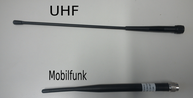
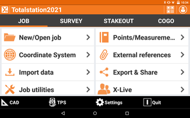
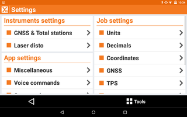
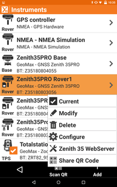

# GNSS in Rover only mode

## Usage

This tutorial covers the configuration of the Geomax Zenith35 Pro GNSS 
in Rover only mode. This mode can be used for open areas with good 
GNSS and mobile signal (same as cellphone signal). With this 
mode, both GNSS systems act independent making two devices available 
for measurements. It is recommended to read the manual first and get 
familiar with some terms (here) before you make actual field work.

## Assembly of the GNSS Rover

#### Materials and Assembly

* GNSS Head
* Battery (check charge, duration ca. 6h)
* Mobile Antenna (Fig. 1)
* Rod (the one without the silver top)
* Mesa 2 Tablet

*Fig.1: Antenna types*

* Insert the battery into the GNSS head
* Assemble the shorter of both antennas at the UMTS Port on the GNSS Head
* Assebmle the head on the rod
* Turn on the power of the GNSS head
* Start the tablet and the XPAD Software

*Fig.2: GNSS Head with modile antenna in the UMTS Port and assembled GNSS Head on rod with fully charged battery pack*

## Configuring XPAD in Rover only mode

XPAD starts with the Job Screen. Choose a job or create a new one and 
you get to the main menu. Tap on _Settings_ and then _GNSS & 
Totalstation_. Here you find a list of all the devices XPAD is able to 
control.

*Fig.3: Main menu and settings menu of XPAD*

#### Devices

There are 3 different configurations for the GNSS Rover. _Zenith35PRO 
Rover1_ and _Zenith35PRO Rover2_ are the ones for Rover only mode. 
Which configuration you want denpends on the Device Number which you 
find as a label on the GNSS Head. 

* _Zenith35PRO Rover1_ is for Device 56
* _Zenith35PRO Rover2_ is for Device 55

The _Zenith35PRO_RoverWithBase_ is covered in another Tutorial.

Tap on the configuration of your device and select _Current_. The 
Software then asks you if you want to configure the device. Tap OK. 
This takes around 1 minute to configure. After the configuration is 
done, go back two times to get to the main menu again.

*Fig.4: Devices menu*

