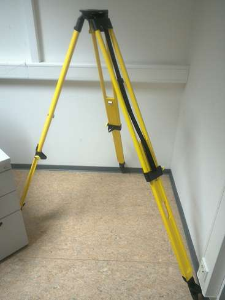
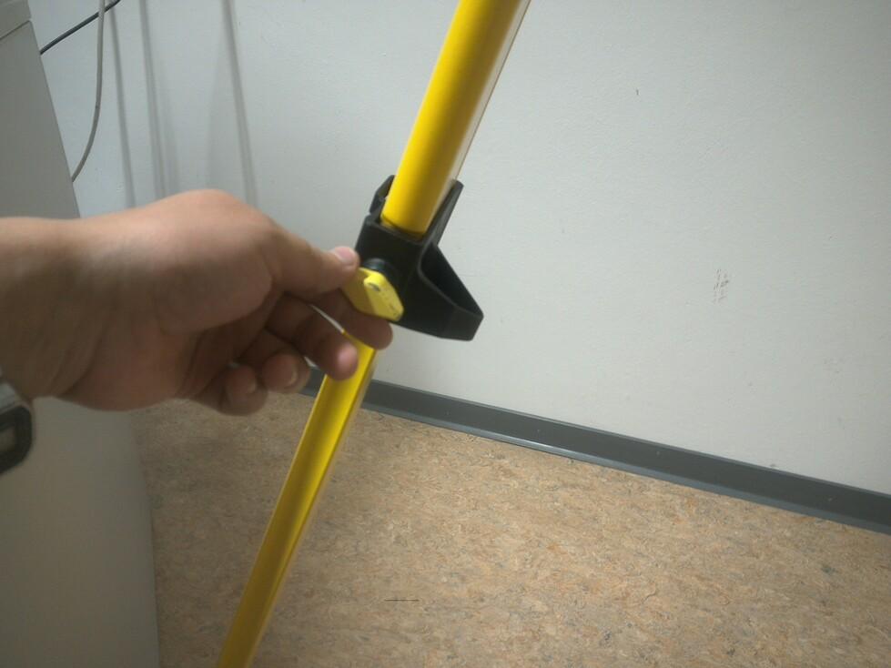
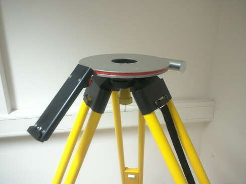
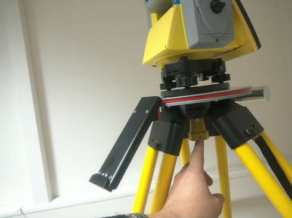
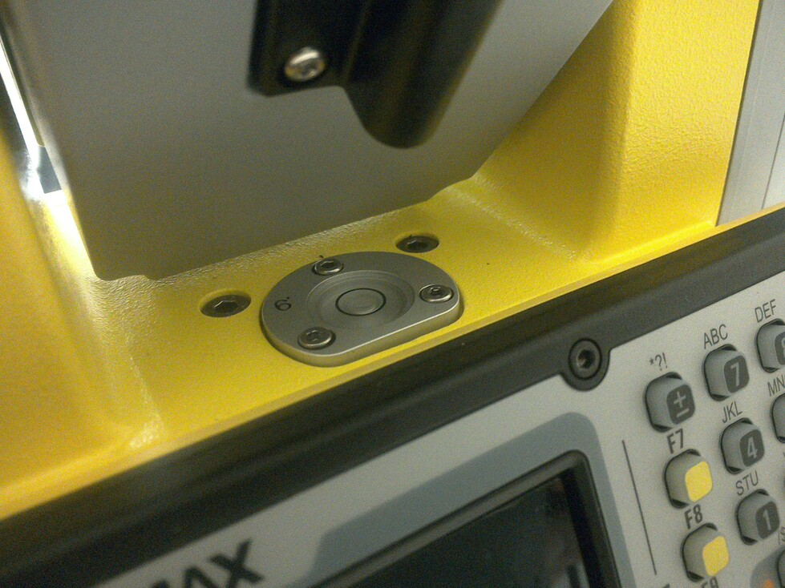
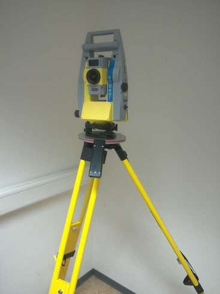

---
title:  "Totalstation Setup"
layout: page
permalink: /Totalstation-Setup/
tags: totalstation
--- 

Attention! All operations with the Total Station (TS) should be gentle. Pack TS to the case if you move it from one point to another.

# Tripod assembly

* Release clamps and extend tripod's legs to a suitable height
* Tighten the clamps

* Press with a foot to all tripod's leg to make a stable connection with the ground
* Make sure that the tripod is very stable and can securely hold TS

# Connect the Total Station

* if applicable, install a tablet holder

* Using always two hands, place TS to the tripod's top
* Secure it with the tripod's screw (underneath) for fixing TS

* Make sure that everything was fixed securely and there is no danger of falling

# Level

* One by one release clamps of legs to make a circular level's bubble roughly in the center; do not use TS's fine-tuning-screws before it
* Make the bubble exactly in the center with the fine-tuning-screws
* It is a bad practice to center the level during measurement, thus, try to be gentle when touching the station 

__Turn on the power button; it is set up now.__

### References
https://www.instructables.com/id/How-to-Set-Up-a-Total-Station-to-Conduct-Surveying/

https://www.slideshare.net/justintgabbard/how-to-set-up-a-total-station-20421558
