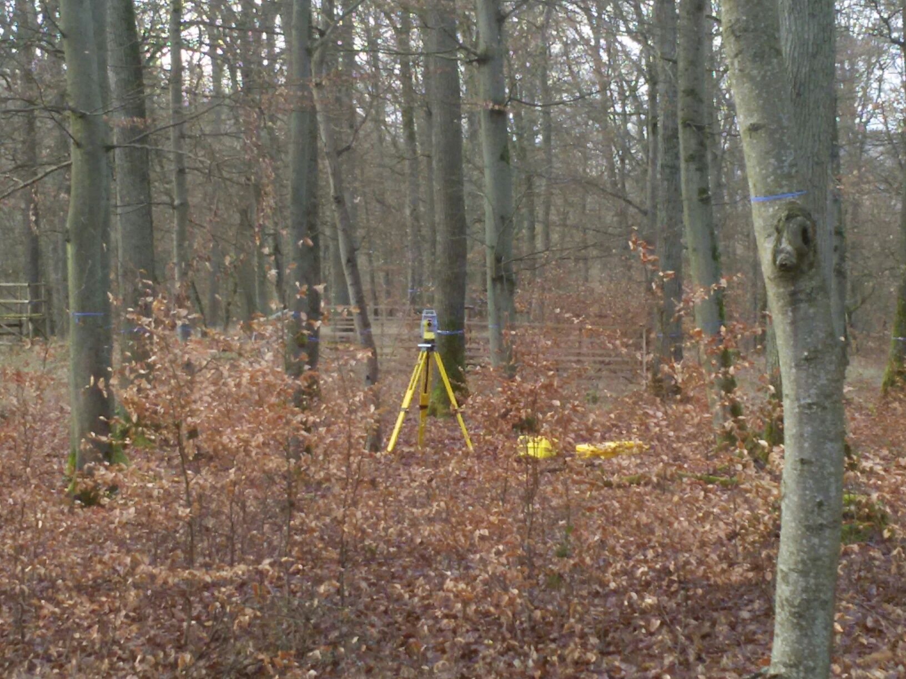
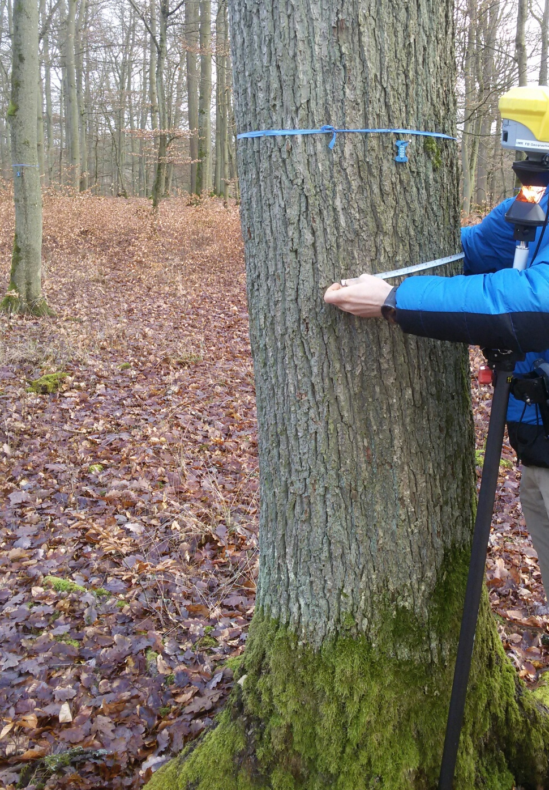

---
title:  "Survey of tree attributes"
layout: page
permalink: /tree-attribut-survey/
--- 

# Tree attributes measures

We propose to measure attributes separately from geometry measurements. TS in robotic mode can follow the prism. That allows us to come to all trees and record all required attributes using a tablet installed on a prism holder. 

The following figure shows TS working in the robotic mode with a prism.

Measuring coordinates of a tree. The prism is installed in front of a tree vertically (using the circular level). 

Definition of attributes (measuring diameter).

Attributes are encoded in a point name field. Here is an example of a point name:

# Point name convention

Here is a proposal for the point names convention. 

TREAT _ (one letter - required) TreeSpeciesCode (if existed)LabelOnTree _ Diameter _ AutoincrementedTreeID

* TreeSpeciesCode: S - spruce, P - pine, B - Beech, O - oak, BI - birch, W - willow  ToBeCompleted...
* Diameter in centimeters on the height 1.3m

Other possible attributes are to be completed...

The point name "TREAT_S124_D56_008" means measuring tree attributes for spruce with existing label 124 with a diameter 56 cm and autoincremented id 008.

