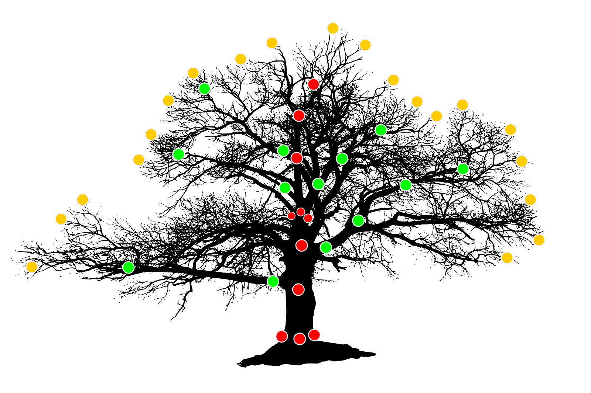

---
title:  "Totalstation tree measures reflectorless"
layout: page
permalink: /ts-tree-survey/
tags: Survey Totalstation
--- 

# Tree Geometry Measure

The geometry is measured in the reflectorless mode and automatically matched with separately measured attributes. 

Three strategies are applicable for measuring trees: minimal (red points), skeleton (red plus green points), and crown (yellow points):

## Minimal Shooting Strategy

Fastest ~5min. Taking a trunk. If possible, it is recommended to shoots left-middle-right point triples close to the bottom and top of a trunk. Minumum five points are recommended to take along a trunk. All points are taken from bottom to top.  

## Skeleton Strategy

~15 min per tree. Taking a trunk and main branches.  Branches are taken from bottom to top. At least two points should be measured from a trunk to the edge. 

## Crown Shooting Strategy

Measuring takes a long time (~2 hours estimated). Thus, it can be done for the core study trees only. 

## Points Names Convention

The following convention is recommended. 

TREGE _ (T|B#|C) _ PointID

T is for a trunk, B - branches, and C for crowns. B should be followed by a brunch number.
PointsID is an autoincremented number.

For instance, 

"TREGE_T_003" - a point on a trunk (geometry shooting),
"TREGE_B1_007" - a point on a brunch,
"TREGE_C_026" - a point for crown shooting.

