---
title:  "Totalstation setup with DGPS Rover"
layout: page
permalink: /Totalstation-Rover/
tags: Totalstation DGPS
description: Learn how to intialize measurements with the total station.
--- 

# Totalstation Setup with DGPS Rover

To get startet with the measurements with the totalstation, you have to know the exact position of the station.
For this, you can use the DGPS to identify exact positions of the prism reflector which you then measure with the totalstation.

## Connecting the equipment

Total station (TS or TPS) can be used with a single rover or rover-base DGPS combinations. The following describes the steps required for measuring terrain and trees in the Marburg Open Forest.

* Start the X-Pad application

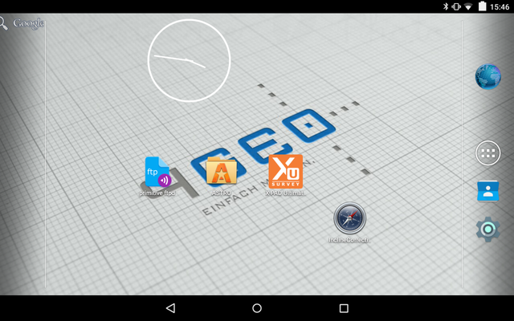

* Select the required job or create a new one

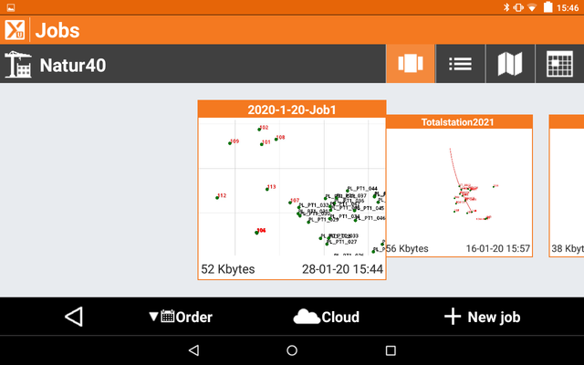

* To connect the equipment press Settings

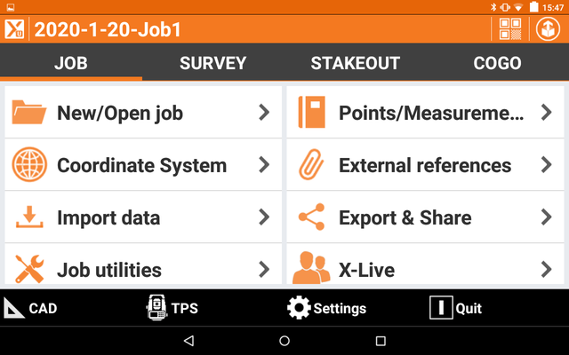

* In Settings, select GNSS and Total station

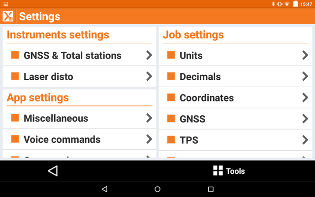

* Depending on the context, tap either Zenith35PRO Rover1 or Zenith35PRO_RoverWithBase

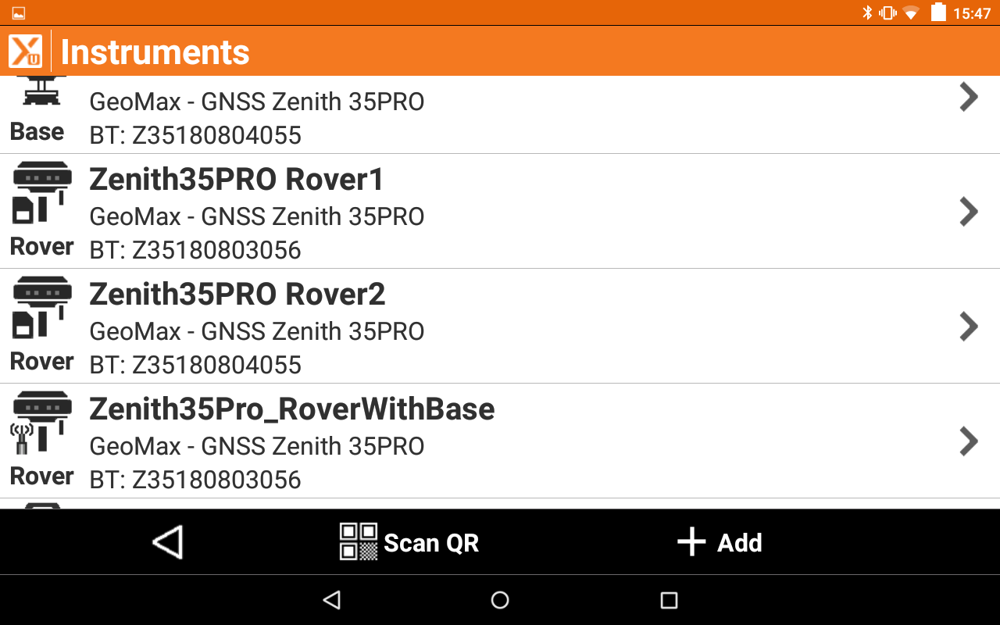

* Press configure and wait until the end of the process

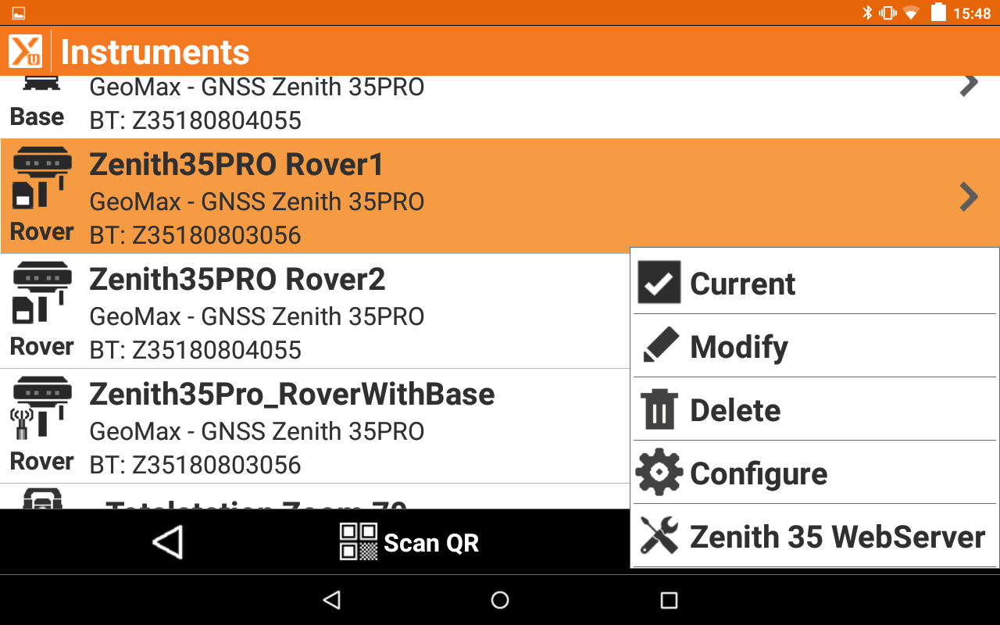

* Tap Totalstation Zoom 70 and choose current

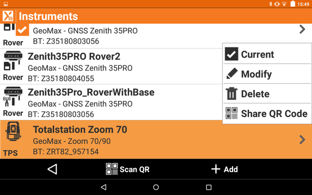

## Station Coordinates and Orientation definition

* Go to Survey tab and tap Station setup

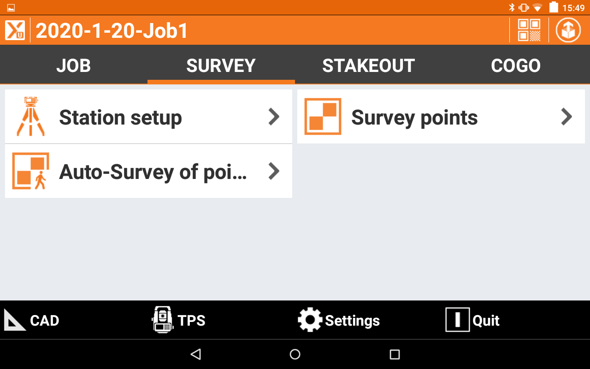

* Press New setup

* Select No. Station position has to be calculated

* Choose Free station

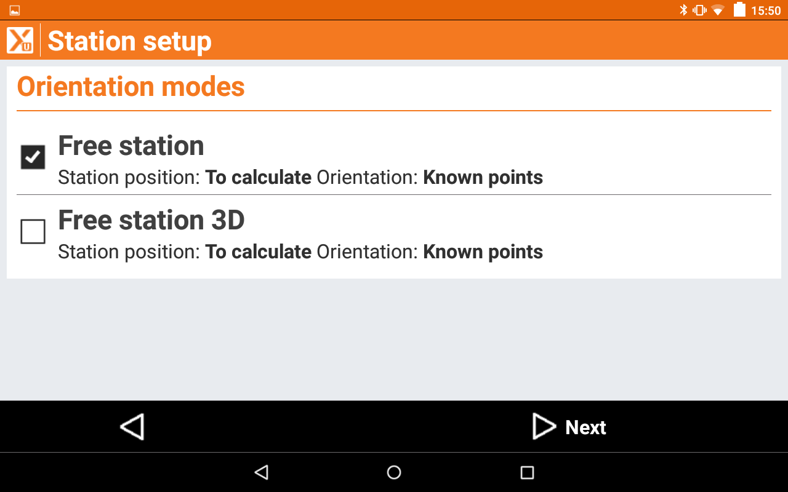

* For Free station, Instr. Height makes no sence (only if the ground point elevation will be used), thus, go Next

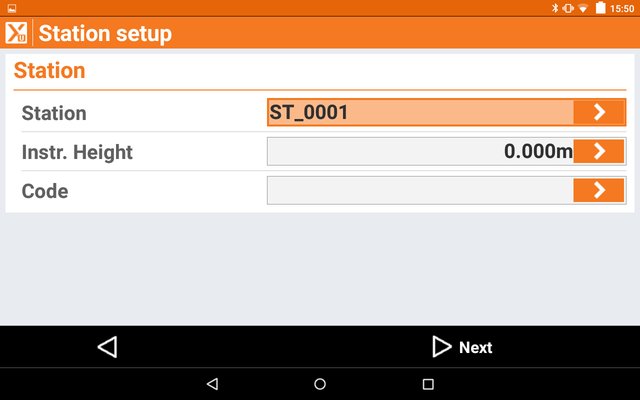

* Specify reference points (minimum two points are required, three recommended)

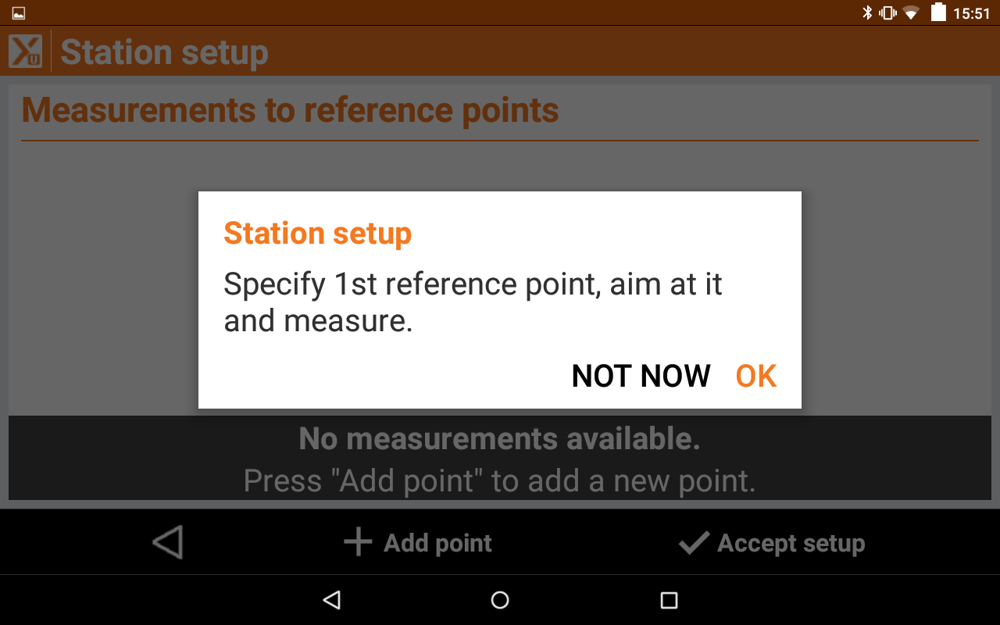

* Select the bottom-left green circle and adjust the level if necessary (do not change the level at any further step!)

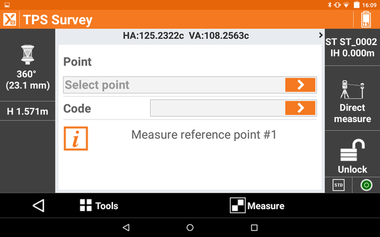

* Press the Unlock button and tap Lock, the TS should be pointed to the prisma with DGPS. Go back

* In the point field select measure and press the Measure button, select the required GPS device

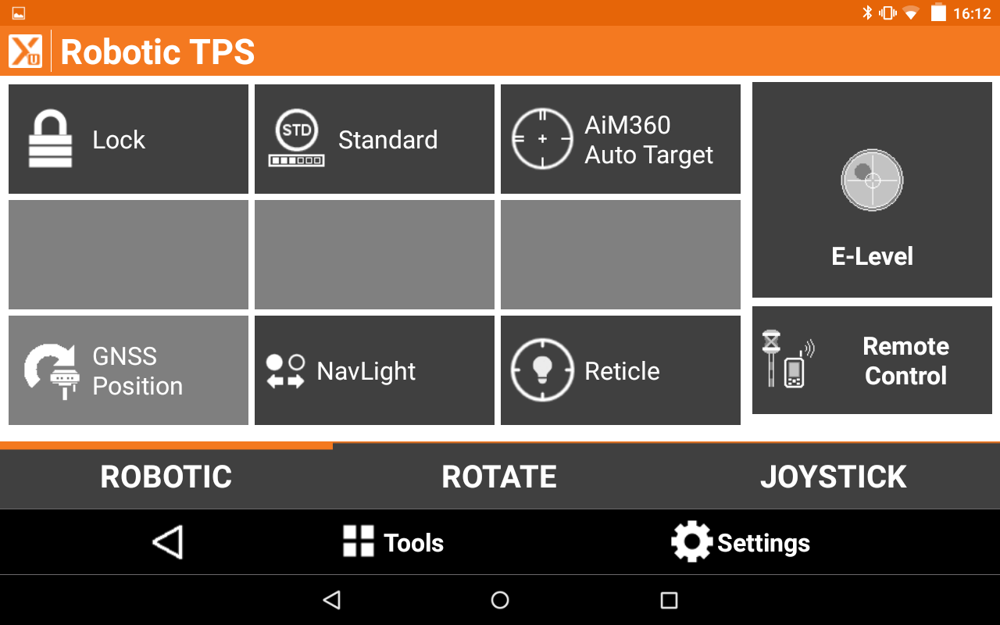

* Set the Antenna height (correct by default)

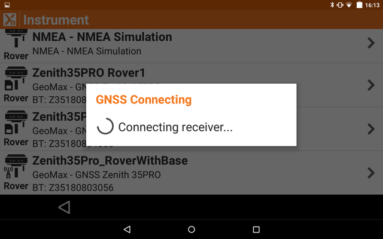

* Make sure that the horizontal and vertical errors are appropriate, press Measure. Change position of the prism and repeate the procedure

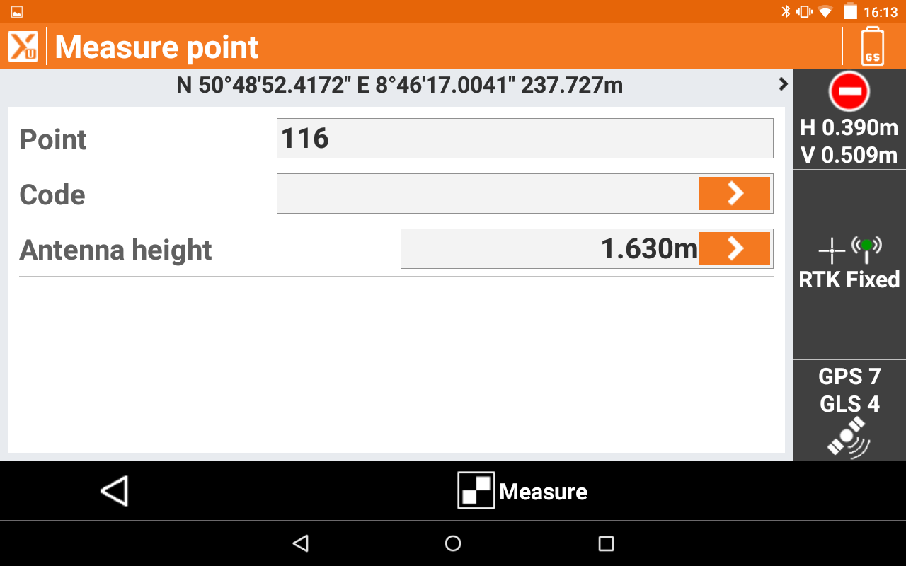

## Shooting/Measuring

* In Survey tab, press survey points, by default measures are conducted with the prism

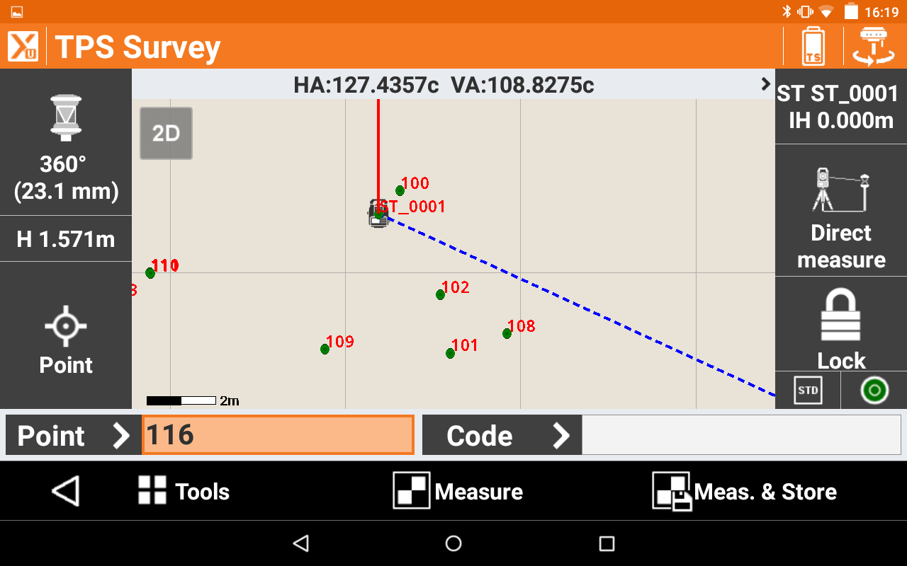

* Tap the top-left prism icon and chose the reflectorless mode for massive shooting, tap the laser pointer to speed up the measurement

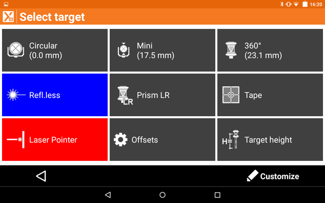

* Use Measure and Store for massive shooting, modify the point name (use conventional prefixes and predefined codes) 

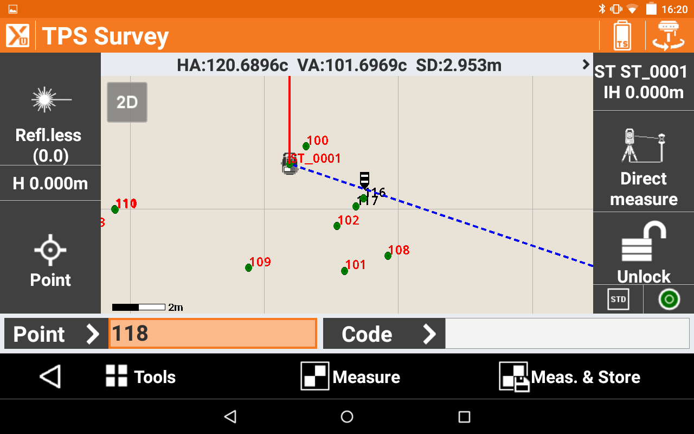
